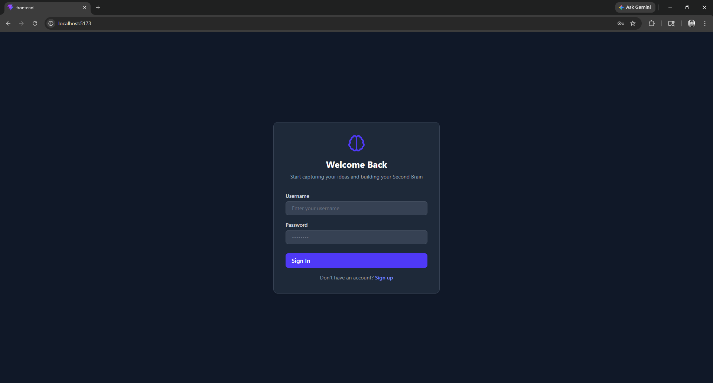
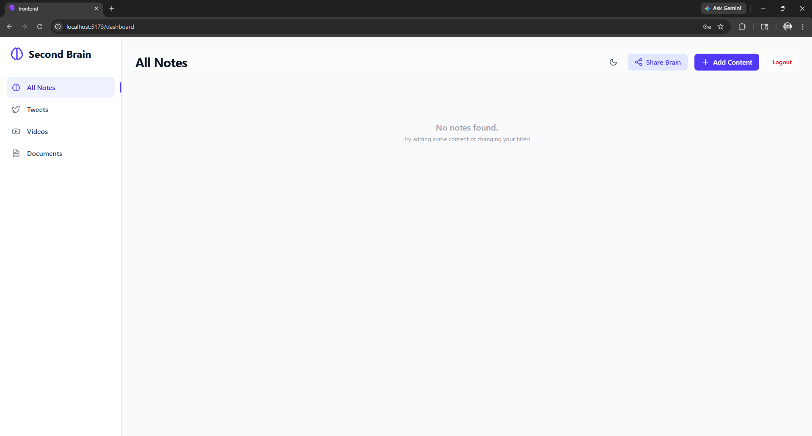
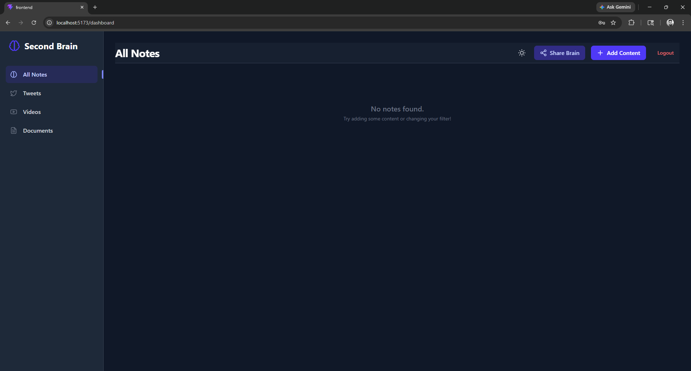
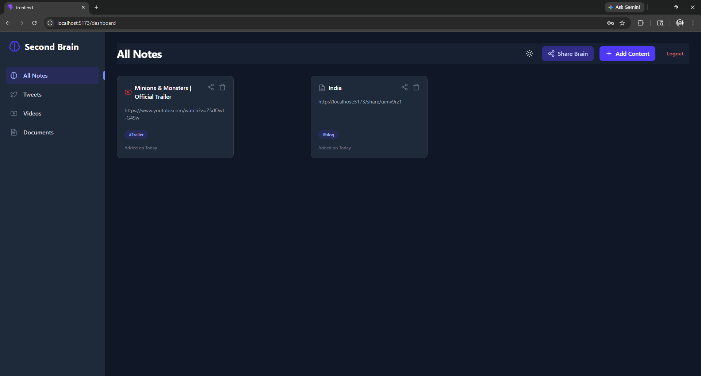
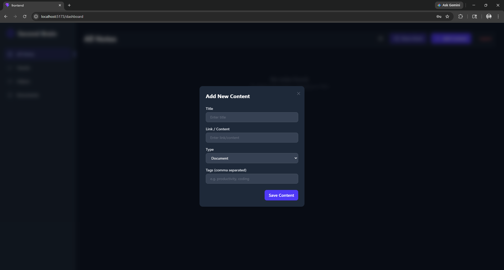
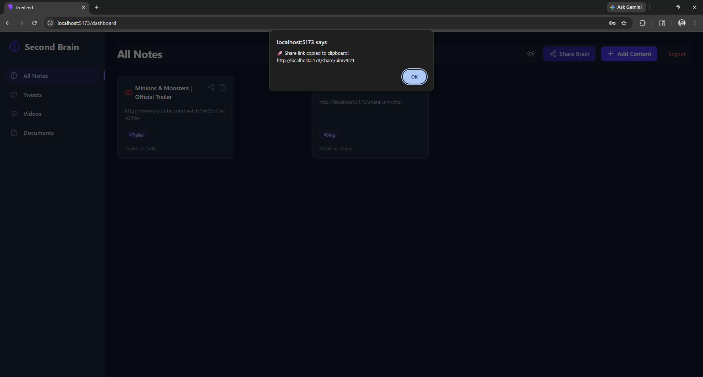
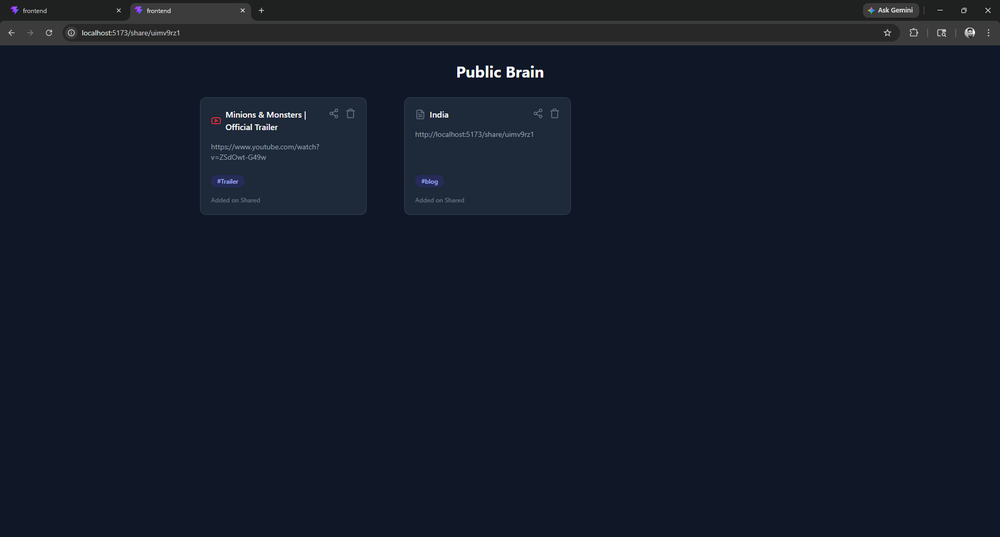

# 🧠 Second Brain Application

A full-stack **Second Brain** app that helps you store, organize, and manage your important links, notes, and content in one place.

Built using:

* ⚙️ Backend: Node.js + Express + TypeScript + MongoDB
* 🎨 Frontend: Vite + React + TypeScript + Tailwind CSS

---

## 🚀 Project Structure

```
second_brain/
│
├── backend/     # Express + MongoDB API
├── frontend/    # React + Vite UI
└── README.md    # Project documentation
```

---

## ⚡ Quick Start (Run Full Project Locally)

Follow these steps to run both backend and frontend together.

---

## 🔧 1. Clone the Repository

```bash
git clone https://github.com/Subhradeep-Sikder/second_brain.git
cd second_brain
```

---

## ⚙️ 2. Setup Backend

```bash
cd backend
npm install
```

### Create `.env` file

```bash
touch .env
```

Add the following:

```env
PORT=3000
MONGO_URI=mongodb://localhost:27017/secondbrain
JWT_SECRET=secret123
```

### Start Backend Server

```bash
npm run dev
```

Backend will run at:

```
http://localhost:3000
```

---

## 🎨 3. Setup Frontend

Open a new terminal:

```bash
cd frontend
npm install
```

### Create `.env` file

```bash
touch .env
```

Add:

```env
VITE_BACKEND_URL=http://localhost:3000/api/v1
```

### Start Frontend

```bash
npm run dev
```

Frontend will run at:

```
http://localhost:5173
```

---

## 🔗 How It Works

1. Frontend (React) sends API requests
2. Backend (Express) processes logic
3. MongoDB stores user data
4. JWT is used for authentication

---

## 📦 Features

* 🔐 User Authentication (JWT-based)
* 🧾 Add / Delete / Manage Content
* 🏷️ Tag-based organization
* 🔗 Store links (YouTube, Twitter, Docs, etc.)
* 📱 Clean and responsive UI
* 🌙 Dark mode support
* 🔗 Share your brain with shareable links

---

## 📸 Screenshots

### Authentication Page


### Dashboard - Light Mode


### Dashboard - Dark Mode


### Dashboard with Sample Content


### Add New Content


### Shared Brain Link


### Public Shared Brain


---

## ⚠️ Important Notes

* Make sure **MongoDB is running locally**
* Start **backend before frontend**
* Never push `.env` files to GitHub
* Restart server after changing `.env`

---

## 🛠️ Tech Stack

**Frontend**

* React
* TypeScript
* Vite
* Tailwind CSS

**Backend**

* Node.js
* Express
* TypeScript
* MongoDB
* JWT Authentication

---

## 📌 Future Improvements

* 🎥 YouTube & Twitter embedding support
* ⚙️ Other UI/UX tweaks and performance improvements
* 📊 Advanced analytics and insights
* 🔔 Notifications and reminders


---

## 👨‍💻 Author

**Subhradeep Sikder**

GitHub: https://github.com/Subhradeep-Sikder

---

## ⭐ Support

If you like this project, give it a ⭐ on GitHub!

---
